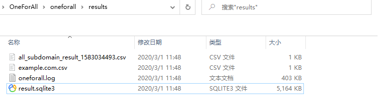
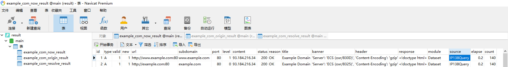

# OneForAll

[](https://travis-ci.org/shmilylty/OneForAll)
[](https://codecov.io/gh/shmilylty/OneForAll)
[](https://codeclimate.com/github/shmilylty/OneForAll/maintainability)
[](https://github.com/shmilylty/OneForAll/tree/master/LICENSE)
[](https://github.com/shmilylty/OneForAll/tree/master/)
[](https://github.com/shmilylty/OneForAll/releases)

👊**OneForAll is a powerful subdomain integration tool**  📝[中文文档](https://github.com/shmilylty/OneForAll/tree/master/README.md)



## 🚀Start Guide

📢 Please read this document to help you start quickly!

<details>
<summary><b>🐍Installation requirements</b></summary>

OneForAll is developed and tested based on [Python 3.6.0](https://www.python.org/downloads/release/python-360/), OneForAll needs to be higher than Python 3.6.0 to run.
For more information on installing the Python environment, please read [Python 3 Installation Guide](https://pythonguidecn.readthedocs.io/zh/latest/starting/installation.html#python-3).

After installation python, run the following command to check the Python and pip3 versions:
```bash
python -V
pip3 -V
```
If you see the following output, there is no problem with the Python environment:
```bash
Python 3.6.0
pip 19.2.2 from C:\Users\shmilylty\AppData\Roaming\Python\Python36\site-packages\pip (python 3.6)
```
</details>

<details>
<summary><b>✔Installation steps (for Git)</b></summary>

1. **Download**

Because OneForAll is under development yet, it is recommended that use `git clone` to clone the latest code repository. Downloading from Releases is not recommended.

If you are in China, it is recommended that you choose [Gitee](https://gitee.com/shmilylty/OneForAll.git) for cloning:

```bash
git clone https://gitee.com/shmilylty/OneForAll.git
```
or: 
```bash
git clone https://github.com/shmilylty/OneForAll.git
```

2. **Installation**


You can use pip3 install requirements, the following is an example of using **pip3** to install dependencies under **Windows**: (Note: If your Python3 is installed in the system Program Files In the directory, such as: `C:\Program Files\Python36`, please run the following as an administrator!)

```bash
cd OneForAll/
python3 -m pip install -U pip setuptools wheel
pip3 install -r requirements.txt
python3 oneforall.py --help
```

For other system platforms, please read [dependency installation](https://github.com/shmilylty/OneForAll/tree/master/docs/installation_dependency.md). If you compile failed during the installation, you can find solution in [Q&A](https://github.com/shmilylty/OneForAll/tree/master/docs/troubleshooting.md) documentation. If still not resolved, welcome [issues](https://github.com/shmilylty/OneForAll/issues).

3. **Update**

Run the following command to **update** project ( maintain your updates to `/config/setting.py`and`/config/api.py`):

```bash
git stash        # Stash local Git changes
git fetch --all  # Fetch updates
git pull         # Pull updates
git stash pop    # Apply the local Git changes stash
```
</details>

<details>
<summary><b>✔Installation steps (for Docker)</b></summary>

```shell
docker pull shmilylty/oneforall
docker run -it --rm -v ~/results:/OneForAll/results oneforall
```
Result will be saved in `~/results`.
</details>

<details>
<summary><b>✨OneForAll usage</b></summary>

If you are use pip3, run the following command: 

```bash
python3 oneforall.py --target example.com run
python3 oneforall.py --targets ./example.txt run
```


</details>

<details>
<summary><b>🧐Instructions for results</b></summary>

Let's take the command `python3 oneforall.py --target example.com run` as an example. When command finished in the default configuration, OneForAll will generate results in the results directory: 



`example.com.csv` is the result for each domain. 

`all_subdomain_result_1583034493.csv` is the result for all domains when your target have multiple domains.

`result.sqlite3` is the SQLite3 database that stores all the subdomains collected by OneForAll. The database structure is shown below: 



`example_com_origin_result` table stores the origin subdomain results of each module. 

`example_com_resolve_result` table stores the results of resolving subdomains.

`example_com_last_result` table stores the results of subdomain collection last time. 

`example_com_now_result` table stores the collection results of the current subdomains. Usually using this table is enough.

For more information, please see [Field explanation](../field.md).

</details>

<details>
<summary><b>🤔Instructions for Use</b></summary>

The CLI only provide some common parameters. For more configuration, please read [setting.py](https://github.com/shmilylty/OneForAll/tree/master/config/setting.py). IF you have any suggestions, welcome feedback. Some modules need access API (most of which are freely available after registered accounts). If you need , please go to [api.py](https://github.com/shmilylty/OneForAll/tree/master/config/api.py) to configure the API. If not used, just ignore the error message. (For module detailes, please read [collection module description](https://github.com/shmilylty/OneForAll/tree/master/docs/collection_modules.md))

The OneForAll command line interface is based on [Fire](https://github.com/google/python-fire/). For more advanced usage of Fire, please refer to [using the Fire CLI](https://github.com/google/Python-fire/blob/master/docs/using-cli.md), if you have any doubts during the use, please feel free to give me feedback.

[oneforall.py](https://github.com/shmilylty/OneForAll/tree/master/oneforall.py) is the program main entrence, and oneforall.py can call [brute.py](https://github.com/shmilylty/OneForAll/tree/master/brute.py), [takerover.py](https://github.com/shmilylty/OneForAll/tree/master/takerover.py), [dbexport.py ](https://github.com/shmilylty/OneForAll/tree/master/dbexport.py) and other modules. But you can also use these modules separately, if you want, please refer to the [usage help](https://github.com/shmilylty/OneForAll/tree/master/docs/en-us/usage_help.md).

❗ Note: When you encounter some problems or doubts during use, please search answers on [issues](https://github.com/shmilylty/OneForAll/issues) first. You can also read [Q&A](https://github.com/shmilylty/OneForAll/tree/master/docs/troubleshooting.md).

**OneForAll help summary**

The following help information may not be up to date. You can use `python oneforall.py --help` to get the latest help information.

```bash
python oneforall.py --help
```
```bash
NAME
    oneforall.py - OneForAll help summary page

SYNOPSIS
    oneforall.py COMMAND | --target=TARGET <flags>

DESCRIPTION
    OneForAll is a powerful subdomain integration tool

    Example:
        python3 oneforall.py version
        python3 oneforall.py --target example.com run
        python3 oneforall.py --targets ./domains.txt run
        python3 oneforall.py --target example.com --alive False run
        python3 oneforall.py --target example.com --brute True run
        python3 oneforall.py --target example.com --port medium run
        python3 oneforall.py --target example.com --fmt csv run
        python3 oneforall.py --target example.com --dns False run
        python3 oneforall.py --target example.com --req False run
        python3 oneforall.py --target example.com --takeover False run
        python3 oneforall.py --target example.com --show True run

    Note:
        --alive  True/False           Only export alive subdomains or not (default False)
        --port   default/small/large  See details in ./config/setting.py(default port 80)
        --fmt csv/json (result format)
        --path   Result directory (default directory is ./results)

ARGUMENTS
    TARGET
        One domain (required)
    TARGETS
        File path of one domain per line (required)

FLAGS
    --brute=BRUTE
        Use brute module (default True)
    --dns=DNS
        Use DNS resolution (default True)
    --req=REQ
        HTTP request subdomains (default True)
    --port=PORT
        The port range request to the subdomains (default port 80)
    --alive=ALIVE
        Only export alive subdomains (default False)
    --fmt=FMT
        Result format (default csv)
    --path=PATH
        Result directory (default None)
    --takeover=TAKEOVER
        Scan subdomain takeover (default False)

COMMANDS
    COMMAND is one of the following:

     version
```
</details>

## 🎉Why OneForAll？

Project address : [https://github.com/shmilylty/OneForAll](https://github.com/shmilylty/OneForAll)

Problems with other tools

* **Not powerful enough**, few api, cannot automate, cannot valid subdomain, etc.

* **Not friendly enough**, do not have a good user interface.

* **Not quickly enough**, do not use multi-process, multi-threading, coroutine, etc.

* **Lack of maintenance**, lots of issues and bugs, and no one fixed it.

In order to solve the above problems, OneForAll born! As its name, OneForAll is committed to becoming the only one subdomain integration tool you need. We hope that one day OneForAll can be called "probably the best subdomain tool"

At present, OneForAll is under development, there must be a lot of problems and areas for improvement. Welcome to submit [Issues](https://github.com/shmilylty/OneForAll/issues) or [PR](https://github.com/shmilylty/OneForAll/pulls), If you like, star please✨. You can contact me through QQ group [**824414244**](https://shang.qq.com/wpa/qunwpa?idkey=125d3689b60445cdbb11e4ddff38036b7f6f2abbf4f7957df5dddba81aa90771) or twitter [tweet](https://twitter.com/shmilylty) to me: 👨‍👨‍👦‍👦.

## 👍Features

* **Powerful collection capability**, For more details, please read [collection module description](https://github.com/shmilylty/OneForAll/tree/master/docs/collection_modules.md).
1. Use 6 certificate modules: `censys_api`, `certspotter`, `crtsh`, `entrust`, `google`, `spyse_api`.
2. Use 6 baseline testing modules: scan domain transfer vulnerability `axfr`, cross-domain policy file `cdx`, HTTPS certificate `cert`, content security policy `csp`, robots file `robots`, and sitemap file `sitemap`, NSEC record `nsec`. NSEC3 record and other modules will be added later.
3. Use 2 web crawler modules: `archirawl`, `commoncrawl`, which is still being debugged and needs to be added and improved). 
4. Use 24 DNS datasets modules: `binaryedge_api`, `bufferover`, `cebaidu`, `chinaz`, `chinaz_api`, `circl_api`, `cloudflare`, `dnsdb_api`, `dnsdumpster`, `hackertarget`, `ip138`, `ipv4info_api`, `netcraft`, `passivedns_api`, `ptrarchive`, `qianxun`, `rapiddns`, `riddler`, `robtex`, `securitytrails_api`, `sitedossier`, `threatcrowd`, `wzpc`, `ximcx`.
5. Use 6 DNS queries modules: enumerating SRV records `srv` and collect from `MX`, `NS`, `SOA`, `TXT`, `SPF`. 
6. Use 6 threat intelligence modules: `alienvault`, `riskiq_ api`, `threatbook_ api`, `threatkeeper `, `virustotal`, `virustotal_ api`, which need to be added and improved.
7. Use 16 search engines modules: `ask`, `baidu`, `bing`, `bing_api`, `fofa_api`, `gitee`, `github_api`, `google`, `google_api`, `shodan_api`, `so`, `sogou`, `yahoo`, `yandex`, `zoomeye_api`, except for special search engines. General search engines support automatic exclusion of search, full search and recursive search. 
* **Support subdomain brute force**, can use dictionary mode or custom fuzz mode. Supports bulk brute and recursive brute, and automatically determine wildcard or not and processing.
* **Support subdomain verification**, default enable, automatically resolve DNS, request subdomain to obtain response, and determine subdomain alive or not.
* **Support subdomain crawling**, according to the existing subdomains, the response body of the request subdomain and the JS in the response body can be found again from the new subdomain.
* **Support subdomain replacement**, according to the existing subdomain, use subdomain replacement technology to discover new subdomains again.
* **Support subdomain takeover**, default enable, supports bulk inspection, and automatic takeover subdomain (only Github, remains to be improved at present).
* **Powerful processing feature**, support automatic deduplicate, DNS resolve, HTTP request, filter valid subdomains and information for subdomains. Supported export formats: `txt`, `csv`, `json`.
* **Very fast**, [collection module](https://github.com/shmilylty/OneForAll/tree/master/collect.py) uses multi-threading, [brute module](https://github.com/shmilylty/OneForAll/tree/master/brute.py) uses [MassDNS](https://github.com/blechschmidt/massdns), MassDNS is capable of resolving over 350,000 names per second using publicly available resolvers. DNS resolve and HTTP requests use async-coroutine. [subdomain takeover](https://github.com/shmilylty/OneForAll/tree/master/takeover.py) uses multi-threading.
* **Good experience**, each module has a progress bar, and save results asynchronously.

If you have any other good ideas, please let me know!😎

## 🌲Directory structure

For more information, please see [Directory structure description](https://github.com/shmilylty/OneForAll/tree/master/docs/directory_structure.md).

Some help and instructions are also provided in the [docs](https://github.com/shmilylty/OneForAll/tree/master/docs/) directory of this project, such as [dictionary Source description](https://github.com/shmilylty/OneForAll/tree/master/docs/dictionary_source.md), [wildcard judgment process](https://github.com/shmilylty/OneForAll/tree/master/docs/wildcard_judgment.png).

## 👏Framework used

* [aiohttp](https://github.com/aio-libs/aiohttp) -  Asynchronous HTTP client/server framework for asyncio and Python
* [beautifulsoup4](https://pypi.org/project/beautifulsoup4/) -  Beautiful Soup is a library that makes it easy to scrape information from web pages
* [fire](https://github.com/google/python-fire) -  Python Fire is a library for automatically generating command line interfaces (CLIs) from absolutely any Python object 
* [loguru](https://github.com/Delgan/loguru) -  Loguru is a library which aims to bring enjoyable logging in Python.
* [massdns](https://github.com/blechschmidt/massdns) - A high-performance DNS stub resolver
* [records](https://github.com/kennethreitz/records) -  Records is a very simple, but powerful, library for making raw SQL queries to most relational databases
* [requests](https://github.com/psf/requests) -  A simple, yet elegant HTTP library
* [tqdm](https://github.com/tqdm/tqdm) -  A Fast, Extensible Progress Bar for Python and CLI 

Thanks to these great Python libraries!

## 🔖Version control

The project uses [SemVer](https://semver.org/) for version management, and you can view the available version in [Releases](https://github.com/shmilylty/OneForAll/releases), You can refer to the [change record instructions](https://github.com/shmilylty/OneForAll/tree/master/docs/changes.md) for historical changes.

## ⌛Follow-up plan

- [ ] Continuous optimize and improve of each module
- [ ] Implementation of front-end interface for powerful interaction

For more details, read [todo.md](https://github.com/shmilylty/OneForAll/tree/master/docs/todo.md).

## 🙏Contribution

Very warmly welcome all people to make OneForAll better together!

## 👨‍💻Contributors

* **[Jing Ling](https://github.com/shmilylty)**
  * Core developer

You can view all contributors and their contributions in the [contributor documentation](https://github.com/shmilylty/OneForAll/tree/master/docs/contributors.md)) and thank them for making OneForAll more powerful and useful.

## 📄License

The project has signed a GPL-3.0 license, for more information, please read [LICENSE](https://github.com/shmilylty/OneForAll/blob/master/LICENSE).

## 😘Acknowledgement

Thanks to the various subdomain collection projects of online open source!

Thanks ace of [A-Team](https://github.com/QAX-A-Team) for their enthusiastic and unselfish answers!

## 📜Disclaimer 

This tool can only be used in the safety construction of enterprises with sufficient legal authorization.
During the use of this tool, you should ensure that all your actions comply with local laws and regulations.
If you have any illegal behavior in the process of using this tool, you will bear all the consequences yourself, 
and all developers and all contributors of this tool will not bear any legal and joint liability.

## 💖Stargazers over time

[](https://starchart.cc/shmilylty/OneForAll)
